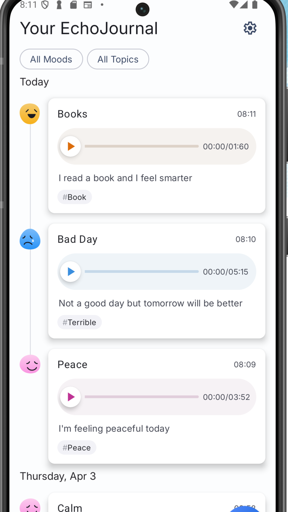

<br />
<div align="center">
  <a href="#">
    
  </a>

<h1 align = "center">
<b><i>Echo Journal</i></b>
</h1>

  <p align="center">
    Android App for Recording Voice Memos
    <br />


  
[Screenshots](#-screenshots) ~
[Features](#-features) ~
[Tech Stack](#-tech-stack) ~
[Getting Started](#getting-started) ~
[Tech Stack](#-tech-stack) ~
[Authors](#️-authors) ~
[Contributing](#-contributing)  
 
</div>

EchoJournal is an Android application for recording, playing, and managing audio entries with mood and topic tagging.
<p align="center">
  <!-- Google Play badge -->
  <a href="https://play.google.com/store/apps/details?id=com.tonyxlab.echojournal" target="_blank">
    
  </a>
</p>
<p align="center">
  <!-- GIF preview -->
  
</p>


## 📸 Screenshots

<p align="center">
 &nbsp;&nbsp;&nbsp;&nbsp;
 &nbsp;&nbsp;&nbsp;&nbsp;   
 &nbsp;&nbsp;&nbsp;&nbsp;


</p># :camera_flash: **Screenshots** :camera_flash:

## 📱 Features

- Record and play audio entries
- Tag entries with moods and topics
- Filter entries by mood and topic
- Save and manage audio files

## 🚀 Tech Stack

- Kotlin
- Jetpack Compose
- Hilt for dependency injection
- Room and DataStore for data persistence
- Coroutines 

## Getting Started

### Prerequisites

- Android Studio Meerkat | 2024.3.1 Patch 1
- Android device or emulator running Android 5.0 (Lollipop) or higher

### Installation

1. Clone the repository:
    ```sh
    git clone https://github.com/your-username/echojournal.git
    ```
2. Open the project in Android Studio.
3. Build the project to download dependencies and set up the environment.


## 🖋️ Authors

**Tonnie** – [@Tonnie-Dev](https://github.com/Tonnie-De)


<a href="https://www.buymeacoffee.com/AgVrgB4N3r" target="_blank"></a>

Do Reach Out :

  * [X](https://twitter.com/Tonnie_Dev)

  * [LinkedIn](https://www.linkedin.com/in/antony-muchiri/)


## 🛂 Contributing

Contributions to make EchoJournal better are always welcome!

If you are interested in seeing a particular feature implemented in this app, please open a new issue after which you can make a PR!


#  :scroll: **License**  :scroll:


```
MIT License

Copyright (c) [2022] [Tonnie Dev]

Permission is hereby granted, free of charge, to any person obtaining a copy
of this software and associated documentation files (the "Software"), to deal
in the Software without restriction, including without limitation the rights
to use, copy, modify, merge, publish, distribute, sublicense, and/or sell
copies of the Software, and to permit persons to whom the Software is
furnished to do so, subject to the following conditions:

The above copyright notice and this permission notice shall be included in all
copies or substantial portions of the Software.

THE SOFTWARE IS PROVIDED "AS IS", WITHOUT WARRANTY OF ANY KIND, EXPRESS OR
IMPLIED, INCLUDING BUT NOT LIMITED TO THE WARRANTIES OF MERCHANTABILITY,
FITNESS FOR A PARTICULAR PURPOSE AND NONINFRINGEMENT. IN NO EVENT SHALL THE
AUTHORS OR COPYRIGHT HOLDERS BE LIABLE FOR ANY CLAIM, DAMAGES OR OTHER
LIABILITY, WHETHER IN AN ACTION OF CONTRACT, TORT OR OTHERWISE, ARISING FROM,
OUT OF OR IN CONNECTION WITH THE SOFTWARE OR THE USE OR OTHER DEALINGS IN THE
SOFTWARE.
```

